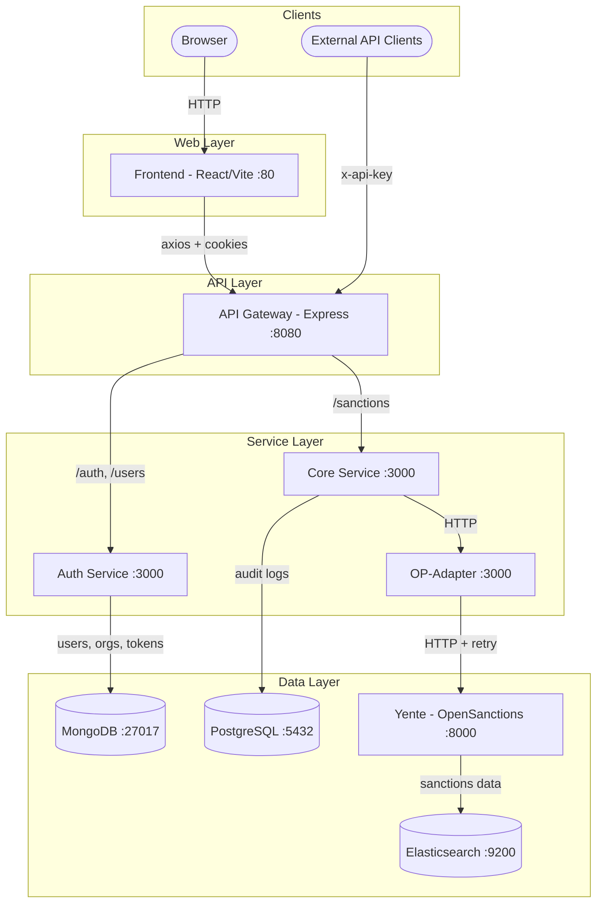

# AML-Checker

Microservice-based platform for sanctions and PEP screening using OpenSanctions (Yente). Includes API Gateway, Auth Service, Core Service, OP-Adapter, and a React frontend. Deployable via Docker Compose.

**Version:** 1.0.0

---

## Table of Contents

- [Quick Start](#quick-start)
- [Architecture](#architecture)
- [Authentication](#authentication)
- [API Endpoints](#api-endpoints)
- [Testing](#testing)
- [Troubleshooting](#troubleshooting)
- [License](#license)

---

## Prerequisites

- [Docker](https://docs.docker.com/get-docker/) + [Docker Compose](https://docs.docker.com/compose/) v2
- [Node.js 18+](https://nodejs.org/) — required only for running tests locally (not needed to run the stack)
- [Git](https://git-scm.com/)

---

## Quick Start

1) Clone and configure:
```bash
git clone <repository-url>
cd AML-Checker
cp .env.example .env
# Required: set JWT_SECRET and REFRESH_TOKEN_SECRET (min 32 chars each).
# Required: set MONGO_INITDB_ROOT_PASSWORD and POSTGRES_PASSWORD.
# Optional: configure EMAIL_* for password-reset emails.
```

2) Configure the sanctions dataset (`manifest.yml` in project root):

```yaml
catalogs:
  - url: "https://data.opensanctions.org/datasets/latest/index.json"
    resource_name: "entities.ftm.json"
    scope: "sanctions"     # broader multi-source sanctions lists (current repo default)
    # scope: "us_ofac_sdn" # US OFAC SDN only (fast, ~200 MB)
    # scope: "default"     # Full global dataset (slow, ~4 GB, requires more RAM)
```

> Change `scope` before first startup. Switching datasets later requires clearing only
> the Yente and Elasticsearch volumes (MongoDB and PostgreSQL data is preserved):
> ```bash
> docker compose down
> docker volume rm $(docker volume ls -q | grep -E 'yente_data|es_data')
> docker compose up --build
> ```

3) Start the stack:
```bash
docker compose up --build
```

> **⚠️ First startup:** Yente downloads the dataset on first run — several minutes for
> `us_ofac_sdn`, much longer for `default`. `/sanctions/check` returns errors until done.
> Watch progress: `docker compose logs -f yente`
>
> **Note:** `YENTE_UPDATE_DATA=true` (default in `.env.example`) re-checks for dataset
> updates on every container restart. Set to `false` after the initial download to skip
> this check and start faster.

4) Access the running stack:
- Frontend: http://localhost (mapped to Vite dev server on 5173)
- API Gateway: http://localhost:8080
- API Docs: http://localhost:8080/api-docs
- Yente: http://localhost:8000

5) Create the first SuperAdmin (MongoDB):

Replace `<MONGO_PASSWORD>` with `MONGO_INITDB_ROOT_PASSWORD` from `.env`.
Replace `auth_db` with `MONGO_DB_NAME` if you changed it (default: `auth_db`).
```bash
docker compose exec mongo mongosh \
  -u admin -p <MONGO_PASSWORD> --authenticationDatabase admin
use auth_db   # replace with your MONGO_DB_NAME if different

var orgId = new ObjectId();
db.organizations.insertOne({
  _id: orgId,
  name: "AML System Corp",
  country: "Global",
  city: "System",
  address: "Root Level",
  apiKey: "sys-" + Math.random().toString(36).substring(7),
  createdAt: new Date()
});

db.users.insertOne({
  email: "super@admin.com",
  // bcrypt hash of "superadmin" — change the password immediately after first login
  passwordHash: "$2b$10$O3PkJxYIkqf50pMYiorDX.Jqyvq.7oxCv5lItV5qEJeYi01anJVXG",
  firstName: "System",
  lastName: "SuperAdmin",
  role: "superadmin",
  organizationId: orgId,
  createdAt: new Date()
});

print("SuperAdmin created. Login: super@admin.com / superadmin");
```

---

## Architecture

### Service Communication Diagram



### Data Flow

1. **Screening request**: Frontend → API Gateway (JWT) → Core Service → OP-Adapter → Yente/Elasticsearch
2. **Authentication**: Frontend → API Gateway → Auth Service → MongoDB
3. **B2B API**: External client → API Gateway (API Key) → Core Service → OP-Adapter → Yente
4. **Audit logging**: Core Service → PostgreSQL (every sanctions check is logged)

### Services (Docker Compose defaults)

- **API Gateway**: exposed on `GATEWAY_PORT` (default 8080)
- **Frontend**: exposed on port 80 (Vite dev server on 5173)
- **Auth Service**: internal only by default
- **Core Service**: internal only by default
- **OP-Adapter**: internal only by default
- **MongoDB**: exposed on `MONGO_PORT` (default 27017)
- **PostgreSQL**: exposed on `POSTGRES_PORT` (default 5432)
- **Yente**: exposed on `YENTE_PORT` (default 8000)
- **Elasticsearch**: exposed on 9200

For service-level details, see:
- [api-gateway/README.md](api-gateway/README.md)
- [auth-service/README.md](auth-service/README.md)
- [core-service/README.md](core-service/README.md)
- [op-adapter/README.md](op-adapter/README.md)
- [frontend/README.md](frontend/README.md)

---

## Authentication

**JWT (user login)**
- `Authorization: Bearer <ACCESS_TOKEN>`
- Refresh token is stored as an HttpOnly cookie
- Refresh flow: `POST /auth/refresh` (cookie-based)

**API Key (B2B)**
- `x-api-key: pk_live_XXXXXX`
- `x-api-secret: sk_live_YYYYYY`

---

## API Endpoints

All requests go through the API Gateway (`http://localhost:8080`).

- `POST /auth/login`
- `POST /auth/logout`
- `POST /auth/refresh`
- `POST /auth/forgot-password`
- `POST /auth/reset-password`
- `POST /auth/change-password`
- `POST /auth/register-organization` (superadmin)
- `POST /auth/register-user` (admin/superadmin)
- `POST /auth/reset-secret`
- `GET /auth/organization/keys`
- `GET /users`
- `POST /users`
- `DELETE /users/:id`
- `GET /sanctions/check`
- `GET /sanctions/history`
- `GET /sanctions/history/export` (CSV export of the full filtered result set)
- `GET /sanctions/stats`
- `GET /sanctions/health`
- `GET /health`

See the service READMEs for detailed request/response formats.

---

## Testing

### Unit / Integration Tests

Root scripts (see [package.json](package.json)):
```bash
npm test              # run all service tests
npm run test:auth
npm run test:core
npm run test:adapter
npm run test:gateway
npm run test:frontend
```

### E2E Tests (Playwright)

E2E tests live in [`tests/e2e/`](tests/e2e/) and require the full Docker Compose stack to be running.

1. Ensure the SuperAdmin exists in MongoDB (see step 5 in [Quick Start](#quick-start)).

2. Copy and fill the E2E environment file:
   ```bash
   cp .env.test.example .env.test
   # Set E2E_SUPERADMIN_EMAIL and E2E_SUPERADMIN_PASSWORD to match the seeded superadmin.
   # E2E_BASE_URL defaults to http://localhost, E2E_GATEWAY_URL to http://localhost:8080.
   ```

3. Start the stack:
   ```bash
   docker compose up --build
   ```

4. Install Playwright dependencies from the project root:
   ```bash
   npm install
   npx playwright install chromium
   ```

5. Run E2E tests (from project root):
   ```bash
   npm run test:e2e           # headless
   npm run test:e2e:headed    # headed (watch the browser)
   npm run test:e2e:ui        # Playwright UI mode
   npm run test:e2e:debug     # step-through debugger
   npm run test:e2e:report    # open last HTML report
   ```

---

## Troubleshooting

- **Gateway fails to start** (`SECURITY ERROR: JWT_SECRET...`): `JWT_SECRET` is missing or empty in `.env`. It is required — the gateway refuses to start without it.
- **Yente downloads datasets on first startup** (can take minutes). See the ⚠️ note in Quick Start.
- **`/sanctions/check` returns 502**: Yente is still downloading its dataset or Elasticsearch is not yet healthy. Check with `docker compose logs -f yente elasticsearch`.
- **Gateway returns 401**: verify `Authorization: Bearer <token>` header (JWT) or `x-api-key` / `x-api-secret` headers (API Key).
- **Audit logs missing**: check core-service logs and PostgreSQL status — `docker compose logs core-service postgres`.
- **Services not starting**: `docker compose logs <service>`.

---

## License

See each service README and package metadata for license details.
